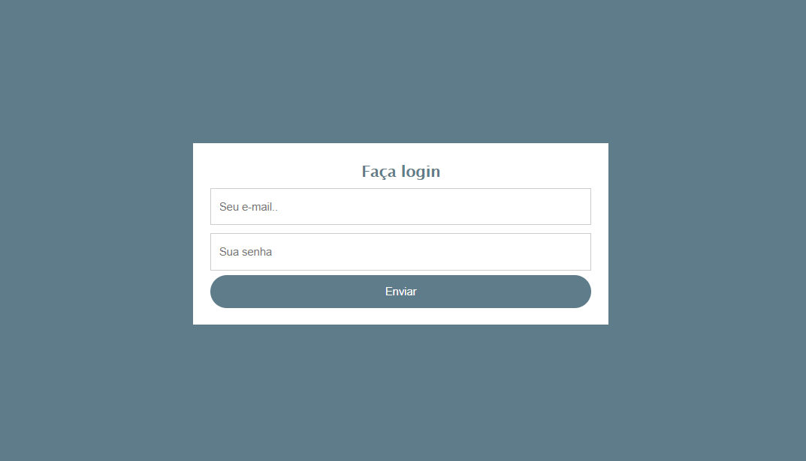

<h1 align="center">
  Login com autenticação e gravação da seção - LocalStorage
  </h1>


<p align="center">
  
  
  
  
</p>

<p align="center">
  <a href="#page_with_curl-sobre">Sobre</a>&nbsp;&nbsp;&nbsp;|&nbsp;&nbsp;&nbsp;
  <a href="#hammer-tecnologias">Tecnologias</a>
  &nbsp;&nbsp;&nbsp;|&nbsp;&nbsp;&nbsp;
  <a href="#books-requisitos">Requisitos</a>&nbsp;&nbsp;&nbsp;|&nbsp;&nbsp;&nbsp;
  <a href="#rocket-começando">Começando</a>&nbsp;&nbsp;&nbsp;|&nbsp;&nbsp;&nbsp;
</p>

<h1 align="center">
  
  
</h1>

## :page_with_curl: Sobre
Este repositório foi criado para atender aos requisitos de um teste imposto por uma empresa.

"LoginAuth" é uma aplicação web que simula a tela de login com autentição de usuário e com gravação da sessão

## :hammer: Tecnologias

Este projeto foi desenvolvido com as seguintes tecnologias:

- [HTML5](https://pt-br.reactjs.org/)
- [Javascript](https://firebase.google.com/)
- [CSS](https://styled-components.com/)
- [VS Code](https://code.visualstudio.com/)

## :books: Requisitos
N/A
## :rocket: Começando
``` bash
  # Clonar o projeto:
  $ https://github.com/CelsoJunioDev/login-auth

  # Abrir o arquivo index.js no navegador
  - E-mail: teste@teste.com
  - Senha: mecontrata
```

Feito por Celso Junio. 👋🏻 [Get in touch!](https://github.com/CelsoJunioDev)
